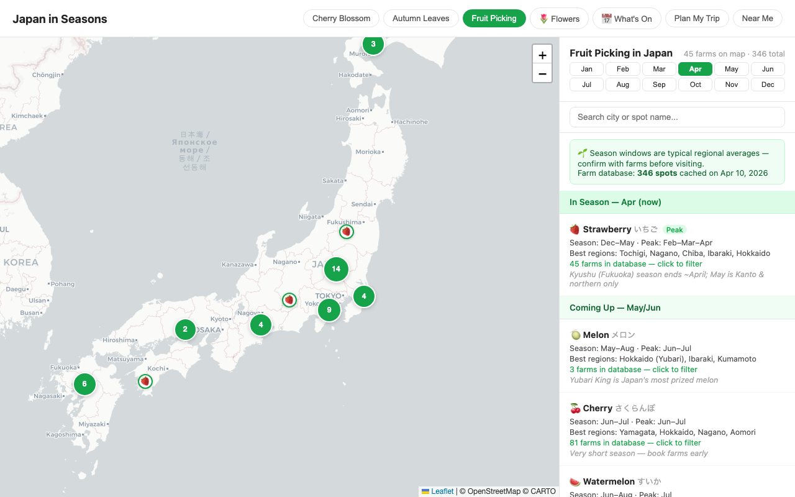
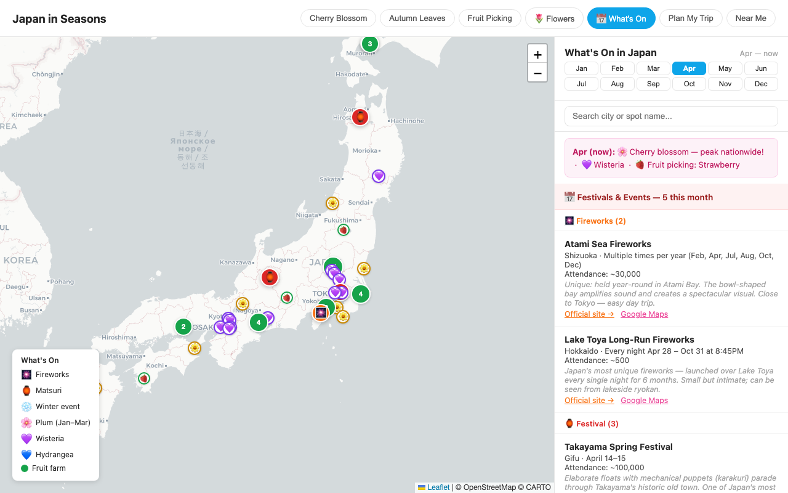
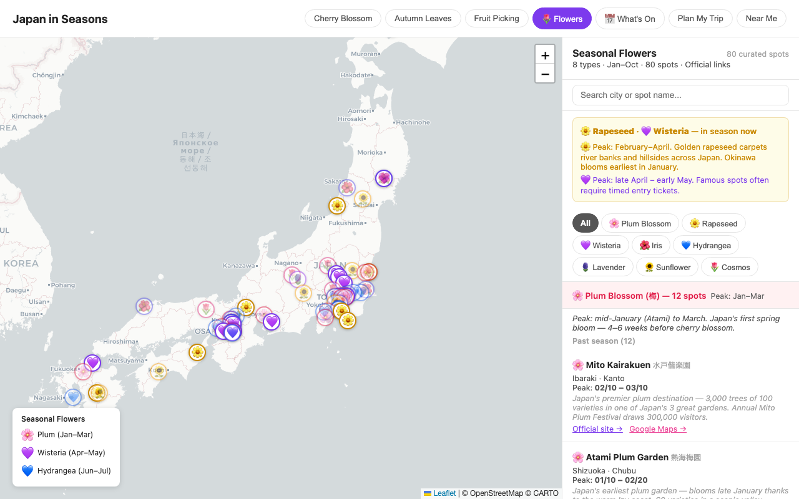
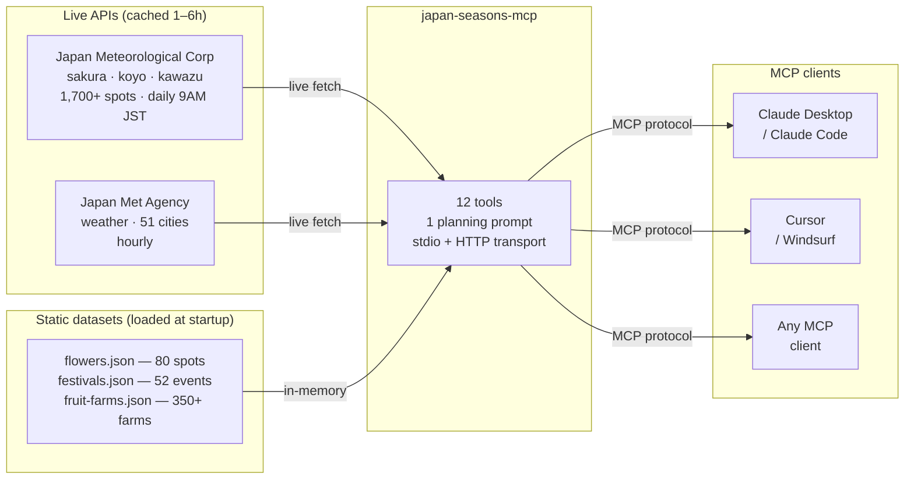

<div align="center">

# 🌸 japan-seasons-mcp

**Give your AI assistant live Japan travel data — cherry blossom forecasts, autumn leaves, fruit picking, flowers, festivals & more.**

*1,700+ spots. 12 tools. Live data from Japan Meteorological Corporation.*

[](https://www.npmjs.com/package/japan-seasons-mcp)
[](https://www.npmjs.com/package/japan-seasons-mcp)
[](LICENSE)
[](https://modelcontextprotocol.io)
[](https://seasons.kooexperience.com)
[](https://smithery.ai/servers/haomingkoo/japan-seasons-mcp)

[**Live map**](https://seasons.kooexperience.com) · [**Hosted MCP endpoint**](https://seasons.kooexperience.com/mcp) · [**npm**](https://www.npmjs.com/package/japan-seasons-mcp)

</div>

---

## Screenshots

| Cherry blossom map | Spot detail & weather |
|---|---|
|  |  |

| Fruit picking | What's On in Japan |
|---|---|
|  |  |

| Flowers in season | Mobile |
|---|---|
|  |  |

---

## The problem

You ask Claude, ChatGPT, or Gemini: *"When should I visit Kyoto for cherry blossoms?"*

You get "late March to early April" — the same answer every year, based on training data that has no idea what this winter was like.

The actual bloom date shifts by 2–3 weeks depending on temperatures. Tokyo peaked March 29 in 2024, March 22 in 2023, March 28 in 2022. Your AI is guessing. This MCP server stops the guessing.

## The fix

It connects Claude (or any MCP client) to live forecast data from the Japan Meteorological Corporation, the same source behind SAKURA NAVI, Japan's most-used cherry blossom app. Data updates daily at 9AM JST.

```
You:    "I'm in Japan April 8–14. Where should I see cherry blossoms?"

Claude: Based on today's JMC forecast data:

        Cities in full bloom during your visit:
        • Sendai (Miyagi) — full bloom forecast Apr 10 (avg Apr 12)
        • Morioka (Iwate) — full bloom forecast Apr 13 (avg Apr 16, running early)
        • Akita — full bloom forecast Apr 14

        For Sendai, top spots include Tsutsujigaoka Park (92% full bloom today)
        and Nishi Park. Morioka Castle ruins are a classic.

        One thing to watch: 40% rain chance Apr 10 in Sendai. Rain speeds up
        petal fall, so Apr 11–12 is probably the safer window.
```

Real bloom percentages. Real park names. Real weather.

---

## Installation

**Claude Desktop / Claude Code / any stdio MCP client**

```json
{
  "mcpServers": {
    "japan-seasons": {
      "command": "npx",
      "args": ["-y", "japan-seasons-mcp"]
    }
  }
}
```

**HTTP endpoint — no install required**

Any MCP client that supports HTTP transport can point directly at the hosted instance:

```
https://seasons.kooexperience.com/mcp
```

Optional connection preferences supported by the hosted endpoint:

- `dateStyle` — `friendly` or `iso`
- `temperatureUnit` — `celsius` or `fahrenheit`
- `includeCoordinates` — `true` or `false`
- `mapLanguage` — `english` or `japanese`

**Self-host**

```bash
PORT=3000 npx -y japan-seasons-mcp --http
# MCP endpoint: http://localhost:3000/mcp
```

---

## What's covered

| Season | Data | Spots | Source |
|--------|------|-------|--------|
| Jan–Feb | Kawazu cherry (early deep-pink variety, Izu Peninsula) | 9 spots | JMC live |
| Jan–Mar | Plum blossoms | 8 spots | curated |
| Mar–May | Cherry blossom (sakura) | **1,012 parks & temples** | JMC live, daily |
| Apr–May | Wisteria | 13 spots | curated |
| May–Jun | Iris gardens | 9 spots | curated |
| Jun–Jul | Hydrangea | 15 spots | curated |
| Jun–Jul | Lavender fields | 6 spots | curated |
| Jul–Aug | Fireworks festivals & summer matsuri | 52 events | curated |
| Jul–Aug | Sunflower fields | 7 spots | curated |
| May–Nov | Fruit picking | **350+ farms**, 14 fruits | Jalan + Navitime |
| Sep–Oct | Cosmos fields | 8 spots | curated |
| Oct–Dec | Autumn leaves (koyo) | **687 viewing spots** | JMC live |
| Jan–Feb | Winter events (Sapporo Snow Festival, etc.) | 8 events | curated |

1,700+ GPS-tagged spots across 12 seasonal categories.

---

## Tools

### Cherry blossom

**`get_sakura_forecast`** — the big picture

All 48 JMA observation cities in one call: this year's forecast, actual dates when observed, and how each city compares to the historical average. Good starting point before you drill into specific spots.

```
"What's the cherry blossom situation in Japan right now?"
→ 48 cities by region, bloom status, forecast dates, days vs average
```

**`get_sakura_spots`** — specific parks and temples

1,012 spots across Japan with current status, bloom percentages, and GPS coordinates. When JMC spot reporters have filed a recent update (within 48 hours), the tool uses that observed status as the primary reading. Otherwise it falls back to the JMC bloom-meter forecast. Stale observations are shown as context, not hidden.

```
"Cherry blossom spots in Kyoto"
→ 51 spots: Kiyomizu-dera (Full bloom, observed Apr 9), Maruyama Park (91% full-bloom)...
```

**`get_sakura_best_dates`** — match travel dates to bloom

Give it your start and end dates, get back the cities where full bloom overlaps your window.

```
"I'm in Japan April 8–14, where should I go?"
→ Cities with bloom in that window, ranked by timing, avg comparison
```

**`get_kawazu_cherry_forecast`** — early-season deep-pink variety

Kawazu cherry blooms January–February in Izu Peninsula, months before standard sakura opens anywhere.

```
"Can I see cherry blossoms in February?"
→ 9 Kawazu spots with bloom %, GPS, forecast dates
```

---

### Autumn leaves

**`get_koyo_forecast`** — maple and ginkgo timing by city

50+ cities with this year's colour-change dates and how they compare to the historical normal. Maple and ginkgo peak at different times; both are included.

```
"When do autumn leaves peak in Kyoto vs Hokkaido?"
→ City-by-city maple/ginkgo dates, days early or late vs average
```

**`get_koyo_best_dates`** — same idea as sakura best dates, for autumn

Match your travel window to cities in peak colour.

```
"I'm in Japan late October, where for autumn leaves?"
→ Cities in peak colour during your dates, maple vs ginkgo timing
```

**`get_koyo_spots`** — 687 viewing spots by prefecture

Each spot has a peak window (start, peak, end), leaf type, popularity rating, and GPS.

```
"Top autumn leaves spots in Kyoto"
→ Arashiyama, Eikando, Tofukuji, Rurikoin... with star rating and exact peak dates
```

---

### Flowers

**`get_seasonal_flowers`** — 80 curated spots, 8 flower types, Jan through Oct

| Type | Season | Notable spots |
|------|---------|--------------|
| Plum | Jan–Mar | Atami, Mito Kairakuen |
| Nanohana | Feb–Apr | Chiba coast, Showa Kinen |
| Wisteria | Apr–May | Ashikaga, Kawachi, Kameido Tenjin |
| Iris | May–Jun | Meiji Jingu, Horikiri Shobuen |
| Hydrangea | Jun–Jul | Meigetsu-in, Hasedera, Yatadera |
| Lavender | Jun–Jul | Furano (Hokkaido) |
| Sunflower | Jul–Aug | Zama, Hokuryu |
| Cosmos | Sep–Oct | Showa Kinen, Hitachi Seaside |

Filter by `type`, `prefecture`, or `month`. Each spot has an official URL and verified GPS.

---

### Festivals and events

**`get_japan_festivals`** — 52 major recurring events with official URLs and attendance figures

```
"Best fireworks festivals in Japan?"
→ Sumida River (900k), Nagaoka (1.1M), Omagari, PL Osaka, Miyajima...

"Festivals in Kyoto in October?"
→ Jidai Matsuri (Oct 22), Kurama Fire Festival, with booking tips
```

Filter by `type` (fireworks / matsuri / winter), `month`, and `prefecture`.

---

### Fruit picking

**`get_fruit_seasons`** — full-year calendar for 14 fruits

Which fruits are in season and at peak for any given month, with best regions and notes.

```
"What fruit can I pick in September in Japan?"
→ Grape at peak (Yamanashi, Nagano), Pear at peak, Peach ending, Apple starting
```

**`get_fruit_farms`** — 350+ farms with GPS and booking links

Pass `month=` and it auto-filters to farms with something in season. Add `region=` to narrow further.

```
"Strawberry farms near Tokyo in April"
→ Farms in the Tokyo/Kanto area with strawberry in season, GPS + Jalan links
```

---

### Weather

**`get_weather_forecast`** — 3-day JMA forecast for 51 cities

Temperature, rain probability by 6-hour window, and conditions. Worth checking because rain speeds up petal fall.

```
"Weather in Osaka this weekend?"
→ Min/max temp, rain % per 6-hour window, conditions
```

---

## Usage

Ask your MCP client for a goal, not a tool name. A few good examples:

```text
"I'm in Japan April 8-14. Where should I go for cherry blossoms?"
"Top autumn leaves spots in Kyoto in late November"
"What flowers are in season in Japan in June?"
"Best fireworks festivals in Japan in August"
"Fruit picking near Tokyo in May"
"Will rain in Osaka this weekend make sakura worse?"
```

Typical workflow:

1. Ask for timing first with `get_sakura_best_dates`, `get_koyo_best_dates`, `get_sakura_forecast`, or `get_koyo_forecast`.
2. Drill into exact parks, temples, farms, or events with `get_sakura_spots`, `get_koyo_spots`, `get_fruit_farms`, `get_seasonal_flowers`, or `get_japan_festivals`.
3. Check `get_weather_forecast` if rain or temperature could change the recommendation.
4. Set optional connection preferences if you want ISO dates, Fahrenheit weather, Japanese map links, or outputs without GPS coordinates.

---

## How it works



Static datasets load at startup and are served from memory with no disk I/O per request. Live JMC data is cached server-side (1–6h TTL). The all-spots payload is pre-gzipped at startup so repeat serving is essentially free.

---

## Bloom scale reference

JMC publishes two separate data products for sakura spots. Both are used:

**Spot observations** — reported by JMC partners and spot managers, used as primary status when updated within 48 hours:

```
State 0  Pre-bloom (buds visible)
State 1  First bloom — 開花 (a few flowers open)
State 2  30% bloom — 三分咲き (sanbu-zaki)
State 3  70% bloom — 七分咲き (nanabu-zaki)
State 4  Full bloom — 満開 (mankai)
State 5  Petals starting to fall — 散り始め
State 6  Green leaves — 葉桜 (hazakura, bloom season over)
```

**Bloom-meter forecast** (jr_data) — mathematical model used as fallback when no fresh observation exists:

```
BLOOM RATE — progress toward first bloom (開花)
─────────────────────────────────────────────────
 0%      60%       85%      100%
 │  Bud   │ Swelling │ Opening │ <- First bloom!
 花芽〜つぼみ  膨らみ始め   開き始め    開花

FULL BLOOM RATE — progress toward mankai / 満開
─────────────────────────────────────────────────
 0%   20%   40%   70%   90%  100%
 │Open│ 30% │ 50% │ 70% │Full │ <- Mankai!
 開花  三分咲き 五分咲き 七分咲き 満開
```

The forecast model stays frozen at full-bloom=100% after peak and cannot detect petal fall or hazakura on its own. Spot observations (states 5–6) are the only way to confirm post-peak status for a specific park.

Peak viewing is typically full bloom ± 3 days. Rain accelerates petal fall.

---

## Web app

[seasons.kooexperience.com](https://seasons.kooexperience.com) is the interactive companion to this MCP server. It shows all the same data on a map — 1,012 sakura spots with lifecycle colours (orange bud, pink bloom, green ended), 687 koyo spots, 350+ fruit farms grouped by location, and 80 flower spots. There's also a "Plan My Trip" mode where you pick cities and see every seasonal activity near each one ranked by distance, and a "Near Me" button that finds spots within 30km of your GPS location.

---

## Development

```bash
git clone https://github.com/haomingkoo/japan-seasons-mcp.git
cd japan-seasons-mcp
npm install
npm run build
npm start            # stdio MCP mode
npm run start:http   # HTTP mode, MCP at http://localhost:3000/mcp
```

TypeScript. No external database. No auth required.

---

## Data sources

| Source | What it provides |
|--------|-----------------|
| [Japan Meteorological Corporation](https://n-kishou.com) | Sakura and koyo forecasts, bloom percentages, 1,700+ viewing spots |
| [Japan Meteorological Agency](https://www.jma.go.jp) via [tsukumijima](https://weather.tsukumijima.net) | City weather forecasts |
| [Jalan](https://www.jalan.net) / [Navitime](https://www.navitime.co.jp) | Fruit picking farm listings |
| Hand-curated | 80 flower spots, 52 festival entries, each with an official URL and verified GPS |

---

## Contributing

PRs welcome, especially for flower spots, festival entries, and farm corrections. See [CONTRIBUTING.md](CONTRIBUTING.md).

---

## Formerly

Previously published as `japan-sakura-koyo-mcp` (deprecated). Use this package instead:

```bash
npx -y japan-seasons-mcp
```

---

## License

[MIT](LICENSE) · Built by [Haoming Koo](https://kooexperience.com)
